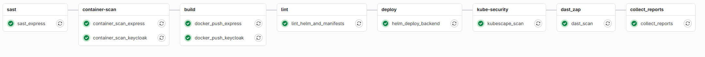

# README - Secure Backend Development on Kubernetes: A DevSecOps Approach with GitLab CI/CD

Il presente lavoro descrive la progettazione e la realizzazione di un’infrastruttura backend sicura e modulare basata su _Kubernetes_, con un’attenzione particolare all’integrazione automatica dei controlli di sicurezza lungo l’intero ciclo di sviluppo. L’architettura segue il paradigma a microservizi e combina diversi componenti chiave: un backend sviluppato in _Node.js_ con _Express_, il sistema di gestione delle identità _Keycloak_, un database _PostgreSQL_ per la persistenza dei dati, _Vault_ per la gestione sicura dei segreti, e una suite di monitoraggio basata su _Prometheus_ e _Grafana_.

Il cuore del progetto è una pipeline _CI/CD_ completamente automatizzata, realizzata su _GitLab_, pensata per incorporare verifiche di sicurezza fin dalle prime fasi dello sviluppo. Ogni commit avvia una serie di controlli: analisi statica del codice (_SAST_) con _ESLint_ e _NodeJsScan_, scansione delle immagini Docker con _Trivy_, verifica dei manifest _Kubernetes_, build e pubblicazione delle immagini, deployment automatizzato tramite _Helm_, e test dinamici (_DAST_) con _OWASP ZAP_. Il processo è strutturato per fermarsi in caso di vulnerabilità gravi, richiedendo interventi correttivi prima di procedere al rilascio.

Per garantire visibilità completa sullo stato di sicurezza del sistema, i risultati prodotti da ciascuna fase vengono raccolti e aggregati in un report centralizzato. Questo include vulnerabilità rilevate a livello di codice, di runtime e di infrastruttura, grazie anche all’impiego di _Kubescape_ per l’analisi della postura di sicurezza del cluster _Kubernetes_. Ogni job produce artefatti utili alla tracciabilità e all’audit delle attività svolte.

Dal punto di vista infrastrutturale, l’architettura adotta misure di sicurezza avanzate: l’uso di _NetworkPolicy_ per limitare le comunicazioni tra i pod, configurazioni di _SecurityContext_ restrittive, gestione automatizzata dei certificati _TLS_ con _Cert-Manager_ e un controllo sicuro degli ingressi verso i servizi esposti, supportato da aggiornamenti _DNS_ dinamici. Completa il sistema un modulo di rilevamento intrusioni basato su _Tetragon_, capace di monitorare eventi anomali a livello kernel – come l’apertura di shell o l’uso sospetto di socket – e inviare notifiche in tempo reale via _Telegram_. Gli eventi vengono inoltre registrati su _Loki_, offrendo strumenti di analisi post-incidente.

Nel complesso, il progetto propone una soluzione concreta, osservabile e completamente automatizzata, in cui i principi del _DevSecOps_ trovano applicazione pratica attraverso strumenti e configurazioni capaci di migliorare sensibilmente la resilienza e la sicurezza dell’ambiente cloud-native.

## La Documentazione

E’ possibile consultare la completa documentazione nella repository:
Secure_Backend_NS_Documentation.pdf

- Introduzione
- Architettura del Sistema
- Sicurezza dell'Infrastruttura
- SecDevOps
- Intrusion Detection e Sicurezza Runtime

## Tools utilizzati

| **BACKEND**               |                         |
| ------------------------- | ----------------------- |
| _Container Orchestration_ | Kubernetes              |
| _Runtime Environment_     | Node.js + Express       |
| _Database_                | PostgreSQL              |
| _Secrets Management_      | Vault                   |
| _Identity & Access_       | Keycloak                |
| _Infrastructure Tools_    | Helm, Cert-Manager      |
| _Security_                | NetworkPolicy, Tetragon |
| _Monitoring_              | Prometheus, Grafana     |
| _Logging_                 | Loki                    |
| _Security Posture_        | Kubescape               |

| **FRONTEND** |                |
| ------------ | -------------- |
| _Framework_  | ReactJS        |
| _Languages_  | HTML, CSS, JSX |

| **TOOLS & DEVOPS**     |                            |
| ---------------------- | -------------------------- |
| _IDE_                  | Visual Studio Code         |
| _Documentation_        | Overleaf                   |
| _CI/CD Platform_       | GitLab                     |
| _SAST_                 | ESLint, NodeJsScan         |
| _DAST_                 | OWASP ZAP                  |
| _Container Scanning_   | Trivy                      |
| _Infrastructure Tests_ | Kubernetes manifest checks |
| _Deployment_           | Helm                       |
| _Intrusion Detection_  | Tetragon                   |
| _Notifications_        | Telegram                   |
| _Audit & Reporting_    | Centralized job artifacts  |
| _Web Hosting_          | DigitalOcean, CloudFlare   |

## DevSecOps

La pipeline GitLab CI/CD implementata in questo progetto integra controlli di sicurezza automatizzati lungo tutto il ciclo di vita del software. È suddivisa in più stage sequenziali, ciascuno dedicato ad attività specifiche come l’analisi statica del codice, la scansione delle immagini container, la validazione dei manifesti Kubernetes, il deployment,
l’analisi della sicurezza del cluster e i test dinamici sull’applicazione.

## Contenuto della repository

Di seguito è riportata una panoramica delle principali cartelle e dei file presenti nella repository, con una breve descrizione delle rispettive funzioni e contenuti.

### Root (`/`)

| Nome                          | Tipo | Descrizione                                                                  |
| ----------------------------- | ---- | ---------------------------------------------------------------------------- |
| `README.md`                   | File | Documentazione introduttiva del progetto.                                    |
| `openapi.json`                | File | Definizione delle API utilizzata per i test automatici con ZAP (stage DAST). |
| `.gitlab-ci.yml`              | File | Configurazione della pipeline CI/CD su GitLab.                               |
| `generate_combined_report.py` | File | Script Python per generare un report HTML unificato dei risultati.           |
| `auth_script.js`              | File | Script per l'autenticazione automatica durante i test ZAP.                   |
| `zap_config.yaml`             | File | File di configurazione per l’esecuzione della scansione DAST con ZAP.        |

---

### `kubernetes/`

| Nome                  | Tipo     | Descrizione                                                                      |
| --------------------- | -------- | -------------------------------------------------------------------------------- |
| `certificate/`        | Cartella | Contiene manifest YAML per la configurazione di Cert-Manager nel cluster.        |
| `chart/`              | Cartella | Helm chart dell’applicazione, con template e file `values.yaml`.                 |
| `dockers/`            | Cartella | Include le directory `express/` e `keycloak/` con i rispettivi Dockerfile.       |
| `guide/`              | Cartella | Contiene guide operative e comandi utili.                                        |
| `helm_charts_values/` | Cartella | Raccolta di file `values.yaml` per i vari Helm charts (Vault, Grafana, ecc.).    |
| `tetragon_policies/`  | Cartella | Manifest YAML per la configurazione delle policy di Tetragon.                    |
| `vault-csi/`          | Cartella | Manifest e SPC per l’injection automatica dei segreti nei pod tramite Vault CSI. |

### `frontend/`

Contiene tutto il necessario per lo sviluppo del frontend dell'applicazione, realizzato in ReactJS. Include i componenti, le pagine, i file statici, le configurazioni di build e le dipendenze specifiche per il client.

## Testing

Per testare e visualizzare l'applicazione in ambiente di staging, è disponibile una demo pubblica accessibile all’indirizzo: [www.frascoengineer.com](http://www.frascoengineer.com).

# Gli Autori

- Francesco Scognamiglio
- Felice Micillo
